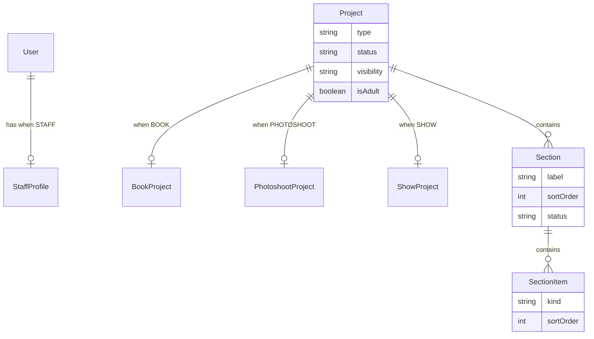
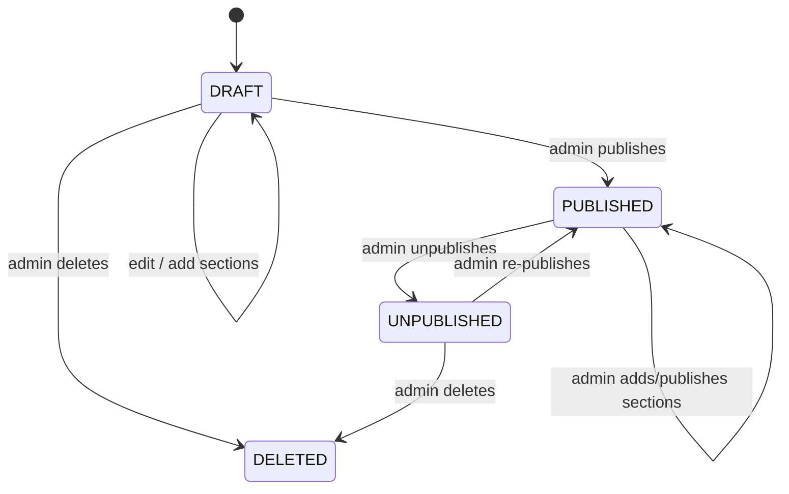

# My Verse — Backend Project Plan

> High-level product and technical plan for the **My Verse** NestJS backend.  
> A specialized Creative Universe Management System.

**Related docs:** [AUTH.md](./AUTH.md) · [SETUP.md](./SETUP.md) · [REGISTRATION.md](./REGISTRATION.md) · [PROJECTS.md](./PROJECTS.md) · [CONTENT_CREATION_GUIDE.md](./CONTENT_CREATION_GUIDE.md) · [Postman](../postman/README.md)

---

## Table of Contents

1. [Vision](#vision)
2. [Technical Stack](#technical-stack)
3. [API Conventions](#api-conventions)
4. [User Types & Permissions](#user-types--permissions)
5. [Registration & Accounts](#registration--accounts)
6. [Content Model](#content-model)
7. [Casting Workflow](#casting-workflow)
8. [Publishing & Visibility](#publishing--visibility)
9. [Access Control](#access-control)
10. [Media & Storage](#media--storage)
11. [MVP Scope](#mvp-scope)
12. [Deferred Features](#deferred-features)
13. [Domain Model](#domain-model)
14. [NestJS Module Map](#nestjs-module-map)
15. [API Surface (High Level)](#api-surface-high-level)
16. [Build Order](#build-order)
17. [Open Decisions](#open-decisions)
18. [Document History](#document-history)
19. [Postman Collections](#postman-collections)

---

## Vision

**My Verse** is a creative universe platform — a mix between Netflix and Instagram — where an admin publishes interconnected entertainment content and casts real staff as fictional characters. Different audiences (admin, staff, public) interact with that content at different permission levels.

The project itself **is** the multiverse. There are no separate universe/franchise containers — just various stories and ideas within one shared world.

### Content philosophy

Content is organized as **Projects** of type **BOOK**, **PHOTOSHOOT**, or **SHOW**. Each project contains **Sections** (creator-defined labels like chapters or episodes) with ordered **SectionItems** (`TEXT`, `IMAGE`, `VIDEO`). Type-specific rules enforce what each section may contain.

Projects have **no structural relationship** to each other.

---

## Technical Stack

| Concern | Choice |
|---------|--------|
| Framework | NestJS (latest) |
| Database | MongoDB |
| ODM | Mongoose (`@nestjs/mongoose`) |
| Auth | JWT bearer token (`@nestjs/passport`, `@nestjs/jwt`) |
| Validation | `class-validator` + DTOs |
| File upload | `@nestjs/platform-express` + `multer` |
| Role enforcement | Hardcoded permissions + `@Roles()` / `@RequirePermission()` guards |
| Media storage | Images in MongoDB (`media` collection); videos on disk (`.uploads/videos/`) |
| Clients | Web and mobile (this repo is API-only) |

### Infrastructure notes

- **API versioning** — all routes prefixed with `/api/v1`
- **Rate limiting** — not implemented in this app; handled by a separate gateway/service
- **Admin bootstrap** — manual seeder script run by deployment team before first start (see [SETUP.md](./SETUP.md))

---

## API Conventions

### Base URL

```
/api/v1
```

### Response envelope

All API responses use a consistent shape:

**Success:**

```json
{
  "success": true,
  "data": { },
  "meta": { }
}
```

`meta` is optional — used for pagination (`page`, `perPage`, `total`, `totalPages`) and similar.

**Error:**

```json
{
  "success": false,
  "data": null,
  "meta": {
    "message": "Human-readable error",
    "statusCode": 400,
    "errors": []
  }
}
```

Implemented via a global response interceptor and exception filter.

### Authentication

Protected routes expect:

```
Authorization: Bearer <accessToken>
```

The login endpoint returns a JWT access token. Refresh tokens are **not** used in v1.

---

## User Types & Permissions

**Admin, Staff, and Public are all `User` records.** Role distinguishes behavior — there is no separate login system per type.

| Role | Description |
|------|-------------|
| **ADMIN** | Full access to everything. Only role that can publish projects and assign staff to characters (Phase 3). Can activate/deactivate accounts. |
| **STAFF** | Performers. Extended profile (see [Registration & Accounts](#registration--accounts)). Can view content, respond to cast requests, and manage own staff profile. |
| **PUBLIC** | General audience. Base user fields only. Can view content per visibility rules. |

### Permission model (v1)

Three roles with **hardcoded permissions in code** — no `roles` or `permissions` collections in MongoDB.

| Permission | ADMIN | STAFF | PUBLIC |
|------------|:-----:|:-----:|:------:|
| `users:manage` | ✓ | — | — |
| `users:read:self` | ✓ | ✓ | ✓ |
| `users:update:self` | ✓ | ✓ | ✓ |
| `staff:read` | ✓ | ✓ | ✓ |
| `staff:update:self` | ✓ | ✓ | — |
| `projects:crud` | ✓ | — | — |
| `projects:publish` | ✓ | — | — |
| `projects:read` | ✓ | ✓ | ✓ |
| `cast:respond` | ✓ | ✓ | — |

**Staff and Public are almost identical** for now. The main differences: Staff has an extended profile, can update it, and can respond to cast requests (when casting is implemented).

Admin can do **any and everything**.

See [AUTH.md](./AUTH.md) for schemas, endpoints, and auth flows.

### Account lifecycle

- **Unique email** — one account per email address
- **Unique username** — one account per username
- **Activate / deactivate** — Admin sets `isActive`. Inactive users cannot log in. Prefer deactivation over hard delete in v1.
- **NSFW** — users have `nsfwEnabled` (default `false`). Required to view adult-tagged content.

---

## Registration & Accounts

### Base `User` fields (everyone)

| Field | Notes |
|-------|--------|
| `email` | Unique, used for login |
| `username` | Unique |
| `password` | Stored as hash only |
| `displayName` | Optional display name |
| `profilePicture` | Optional `FileMeta` (see [REGISTRATION.md](./REGISTRATION.md)) |
| `role` | `ADMIN` \| `STAFF` \| `PUBLIC` |
| `isActive` | Default `true`; Admin can toggle |
| `nsfwEnabled` | Default `false` |
| `defaultVisibility` | Optional; used when user publishes (mainly Admin) |

### `StaffProfile` (role `STAFF` only)

Separate collection linked to `User` via `userId`. Public users do not have a staff profile.

Extended fields include performer metadata (stage name, bio, skills, social links, etc.). Full field list: [REGISTRATION.md](./REGISTRATION.md).

| Field | Notes |
|-------|--------|
| `isProfileComplete` | `true` when user has `profilePicture` + staff has `stageName` and `bio` |

Profile photo lives on **`User.profilePicture`** (`FileMeta`), not on StaffProfile.

Incomplete staff profiles may be hidden from public staff listings.

### Registration paths

See **[REGISTRATION.md](./REGISTRATION.md)** for full field specs.

```
Step 0 — Upload profile picture (optional for PUBLIC, required for STAFF)
  POST /api/v1/media/upload  → FileMeta

Path A — Public self-register
  POST /api/v1/auth/register  (JSON + optional profilePicture FileMeta)
  → role: PUBLIC

Path B — Staff self-register
  POST /api/v1/auth/register/staff  (JSON + required profilePicture FileMeta)
  → role: STAFF + StaffProfile

Path C — Admin creates account
  POST /api/v1/users  (admin only)
  → profilePicture FileMeta required for STAFF
```

---

## Content Model

See **[PROJECTS.md](./PROJECTS.md)** for full Phase 2 specification.

### Project

The central publishable entity. Three types: `BOOK`, `PHOTOSHOOT`, `SHOW`.

| Field | Notes |
|-------|--------|
| `type` | `BOOK` \| `PHOTOSHOOT` \| `SHOW` |
| `title`, `slug` | Identity and URL (unique slug) |
| `description` | Optional summary |
| `status` | `DRAFT` \| `PUBLISHED` \| `UNPUBLISHED` \| `DELETED` |
| `visibility` | Per-project setting (see [Publishing & Visibility](#publishing--visibility)) |
| `isAdult` | NSFW flag |
| `createdBy` | Admin user ID |
| `publishedAt` | Nullable timestamp |

Type extensions (1:1 collections): `BookProject` (`summary`), `PhotoshootProject` (`theme`, `location`), `ShowProject` (`genre`).

### Section

Shared across all project types. Creator-defined `label` (e.g. "Chapter 1", "Episode 3").

| Field | Notes |
|-------|--------|
| `projectId` | Parent project |
| `label`, `description` | Creator-defined |
| `sortOrder` | Reorderable |
| `status` | `DRAFT` \| `PUBLISHED` \| `UNPUBLISHED` |
| `publishedAt` | Nullable |

Sections can be added **after** the project is published. Two-level publish: public sees content only when both project and section are `PUBLISHED`.

### SectionItem

Ordered content within a section.

| Kind | Payload |
|------|---------|
| `TEXT` | `textContent` |
| `IMAGE` | `FileMeta` + optional `label` |
| `VIDEO` | `FileMeta` + `durationSeconds` |

### Type validation (server-side)

| Type | Rules |
|------|-------|
| BOOK | TEXT allowed; optional IMAGE/VIDEO per section |
| PHOTOSHOOT | 1–120 IMAGE items per section |
| SHOW | At most 1 VIDEO per section (+ optional TEXT) |

### Phase 3 — Characters & casting (deferred)

#### Character (fictional)

- Belongs to a project (BOOK/SHOW)
- `name`, `bio`, optional `avatar`
- **Not** 1:1 with staff — characters are fictional entities

#### Cast assignment

- Links a **fictional character** to a **real staff user** (`role: STAFF`)
- Status: `PENDING` \| `ACCEPTED` \| `DECLINED` \| `REVOKED`
- Publish gate when casts pending (Phase 3)

---

## Casting Workflow (Phase 3 — deferred)

Staff are real users. Characters they play are fictional.

```
Admin creates draft project + characters
        ↓
Admin sends cast request (Staff A → Character X on Project P)
        ↓
Staff receives request → Accept or Decline
        ↓
Project cannot be published until all required casts are ACCEPTED
        ↓
Admin publishes
```

### Rules

- Cast requests are sent **to the staff member**, who must **accept** before they appear on published content.
- Only Admin can send cast requests (for MVP).

> **Phase 2 note:** Casting is not implemented. Projects can be published without cast validation.

---

## Publishing & Visibility

### Publishing

- **Only Admin** can publish projects and sections.
- No scheduled publish at the API level (v1).
- Drafts can be **unpublished** or **deleted** (soft delete).
- **Two-level publish:** project must be `PUBLISHED`; public sees only `PUBLISHED` sections within it.
- A project may be published with zero published sections ("coming soon").
- Cast publish gate deferred to Phase 3.

### Visibility

Visibility is set **per project**:

| Value | Meaning |
|-------|---------|
| `PUBLIC` | Anyone (subject to NSFW rules) |
| `AUTHENTICATED` | Logged-in users only |
| `STAFF_ONLY` | Staff and Admin |
| `PRIVATE` | Admin only |

---

## Access Control

| Viewer | Non-adult public project | Adult project | Staff-only project |
|--------|-------------------------|---------------|-------------------|
| Anonymous | View if `PUBLIC` | Denied | Denied |
| Logged-in public | View if visibility allows | View if `nsfwEnabled` | Denied unless allowed |
| Staff | View per visibility | View if `nsfwEnabled` | View if `STAFF_ONLY` or broader |
| Admin | Always | Always | Always |

Implemented via `ProjectAccessService` and optional JWT on public read routes.

---

## Media & Storage

### Directory layout

```
MongoDB media collection   # profile + project images (BSON Binary)
.uploads/videos/           # project videos only (gitignored)
```

### Access (v1)

Images served via `GET /api/v1/media/images/:id` (raw bytes for ``; `?format=json` for optional base64). Videos at `/uploads/videos/...`. Authenticated/signed URLs may be added later.

### Per-project limits (enforced on create/update and publish)

| Type | Limit |
|------|--------|
| **Text** | ≤ 5,000,000 characters per project |
| **Images** | ≤ 120 images, ≤ 60 MB total per project |
| **Video** | ≤ 120 minutes, ≤ 500 MB total per project |

### Project image limits (Phase 2)

| Type | Limit |
|------|--------|
| **Project image** | ≤ 10 MB; jpg, png, webp |

### Project video limits (Phase 2)

| Type | Limit |
|------|--------|
| **Project video** | ≤ 500 MB; mp4, webm |

### Profile image limits (Phase 1)

| Type | Limit |
|------|--------|
| **Profile image** | ≤ 5 MB; jpg, png, webp only |

Abstract uploads behind a `StorageService` for future cloud migration.

---

## MVP Scope

### Phase 1 — Auth foundation (completed)

- [x] NestJS scaffold + MongoDB + Mongoose
- [x] API versioning (`/api/v1`) + response envelope
- [x] Login / JWT authentication
- [x] Public self-registration
- [x] Staff self-registration (extended form + profile image)
- [x] Admin user management (CRUD, activate/deactivate)
- [x] Staff profiles (list, view, self-update)
- [x] Minimal media upload (profile images)
- [x] Admin seeder script
- [x] `.uploads/` directory (gitignored, publicly served)

### Phase 2 — Projects, sections & content (completed)

- [x] Admin CRUD for projects (BOOK, PHOTOSHOOT, SHOW)
- [x] Sections with creator-defined labels, reorder, per-section publish
- [x] SectionItems (TEXT, IMAGE, VIDEO) with FileMeta two-step upload
- [x] Publish / unpublish / soft-delete (Admin only)
- [x] Per-project visibility settings
- [x] NSFW gating for adult-tagged projects
- [x] Project media upload (`/media/upload/image`, `/media/upload/video`) with limit validation
- [x] Read APIs for Staff and Public (and anonymous where allowed)
- [x] Documentation ([PROJECTS.md](./PROJECTS.md)) and Postman collection

### Phase 3 — Casting (later)

- [ ] Fictional characters on BOOK/SHOW projects
- [ ] Cast request workflow (send, accept, decline)
- [ ] Publish gate when casts pending

### Out of scope (v1)

See [Deferred Features](#deferred-features).

---

## Deferred Features

| Feature | Notes |
|---------|-------|
| **Movies module** | Use generic video content blocks instead |
| **Photoshoot module** | Use generic image content blocks instead |
| **Likes / reactions** | Including thumbs up |
| **Ratings** | Stars (1–5) |
| **Comments & threaded replies** | |
| **Moderation queue** | Not needed |
| **Scheduled publish** | Not needed |
| **Dynamic RBAC** | Hardcoded roles for now |
| **JWT refresh tokens** | Access token only in v1 |
| **Rate limiting** | Handled by separate app |
| **Private / signed upload URLs** | Public `.uploads/` for now |
| **Cast requests from non-admin** | Only Admin sends requests for now |

---

## Domain Model

```
User
 ├── email, username (unique)
 ├── profilePicture?: FileMeta
 ├── role: ADMIN | STAFF | PUBLIC
 ├── isActive, nsfwEnabled
 └── StaffProfile? (when role === STAFF)

Project (BOOK | PHOTOSHOOT | SHOW)
 ├── BookProject | PhotoshootProject | ShowProject
 ├── status: DRAFT | PUBLISHED | UNPUBLISHED | DELETED
 ├── visibility, isAdult
 └── Section[]
      └── SectionItem[] (TEXT | IMAGE | VIDEO)

Phase 3:
 └── Character[] (fictional)
      └── CastAssignment → User (STAFF)
```

### Entity relationships



### Project lifecycle



---

## NestJS Module Map

```
src/
├── main.ts
├── app.module.ts
├── config/
├── common/
│   ├── decorators/     # @Roles, @CurrentUser, @Public, @RequirePermission
│   ├── guards/         # JwtAuthGuard, RolesGuard, PermissionsGuard
│   ├── interceptors/   # Response envelope
│   ├── filters/        # Error envelope
│   ├── enums/
│   └── constants/      # permissions.ts
├── auth/
├── users/
├── staff/
├── media/              # upload + static serve
├── projects/           # Phase 2 — project CRUD, publish
├── sections/           # Phase 2 — section CRUD, reorder, publish
├── section-items/      # Phase 2 — item CRUD, reorder
└── access/             # Phase 2 — ProjectAccessService
```

Phase 3 (planned): `characters/`, `casting/`

---

## API Surface (High Level)

All routes prefixed with `/api/v1`. See [AUTH.md](./AUTH.md) for Phase 1 detail.

### Auth & users (Phase 1)

| Method | Endpoint | Access |
|--------|----------|--------|
| `POST` | `/auth/register` | Public |
| `POST` | `/auth/register/staff` | Public |
| `POST` | `/auth/login` | Public |
| `GET` | `/auth/me` | JWT |
| `GET` | `/users` | Admin |
| `POST` | `/users` | Admin |
| `PATCH` | `/users/:id` | Admin |
| `PATCH` | `/users/:id/activate` | Admin |
| `PATCH` | `/users/:id/deactivate` | Admin |
| `PATCH` | `/users/me` | JWT (self) |
| `GET` | `/staff` | Public / authenticated |
| `GET` | `/staff/:id` | Public |
| `PATCH` | `/staff/me` | Staff |
| `POST` | `/media/upload` | Public (profile images) |
| `POST` | `/media/upload/image` | Public (project images) |
| `POST` | `/media/upload/video` | Public (project videos) |
| `GET` | `/health` | Public |

### Projects & content (Phase 2)

See [PROJECTS.md](./PROJECTS.md) for full detail.

| Method | Endpoint | Description |
|--------|----------|-------------|
| `POST` | `/projects` | Create project (admin) |
| `GET` | `/projects` | List projects |
| `GET` | `/projects/:id` | Single project with sections |
| `PATCH` | `/projects/:id` | Update project |
| `DELETE` | `/projects/:id` | Soft-delete |
| `POST` | `/projects/:id/publish` | Publish |
| `POST` | `/projects/:id/unpublish` | Unpublish |
| `PATCH` | `/projects/:id/visibility` | Set visibility |
| `POST` | `/projects/:projectId/sections` | Add section |
| `PATCH` | `/projects/:projectId/sections/:sectionId` | Update section |
| `DELETE` | `/projects/:projectId/sections/:sectionId` | Delete section |
| `PATCH` | `/projects/:projectId/sections/reorder` | Reorder sections |
| `POST` | `/projects/:projectId/sections/:sectionId/publish` | Publish section |
| `POST` | `/projects/:projectId/sections/:sectionId/unpublish` | Unpublish section |
| `POST` | `/projects/.../items` | Add section item |
| `PATCH` | `/projects/.../items/:itemId` | Update item |
| `DELETE` | `/projects/.../items/:itemId` | Delete item |
| `PATCH` | `/projects/.../items/reorder` | Reorder items |

### Casting (Phase 3)

| Method | Endpoint | Description |
|--------|----------|-------------|
| `POST` | `/projects/:id/characters` | Add character |
| `POST` | `/projects/:id/characters/:charId/cast-requests` | Admin sends cast request |
| `GET` | `/cast-requests` | Staff: mine; Admin: all |
| `POST` | `/cast-requests/:id/accept` | Staff accepts |
| `POST` | `/cast-requests/:id/decline` | Staff declines |

---

## Build Order

### Phase 1 — Auth foundation

1. Project scaffold — NestJS, Mongoose, env config, health check
2. Global API prefix, response interceptor, exception filter
3. Users schema + StaffProfile schema
4. Auth module — register, register/staff, login, me, JWT guards
5. Users module — admin CRUD, activate/deactivate, self profile
6. Staff module — list, view, self-update
7. Media module — profile upload, static `.uploads/` serve
8. Admin seeder script
9. Documentation (this file, AUTH.md, SETUP.md)

### Phase 2 — Projects, sections & content

1. Documentation — [PROJECTS.md](./PROJECTS.md), update plan and Postman
2. Schemas — Project, type extensions, Section, SectionItem
3. Projects module — CRUD, publish, visibility
4. Sections module — CRUD, reorder, per-section publish
5. Section items — TEXT/IMAGE/VIDEO with limits
6. Media — project image/video upload endpoints
7. Access — `ProjectAccessService` on public read APIs

### Phase 3 — Casting

1. Characters on BOOK/SHOW projects
2. Cast request workflow
3. Publish gate when casts pending

---

## Open Decisions

| # | Question | Status | Notes |
|---|----------|--------|-------|
| 1 | **Chapters vs blocks** | Resolved | Replaced by Sections + SectionItems |
| 2 | **Declined cast** | Open | Block publish until recast, or allow character without cast? |
| 3 | **Staff self-register approval** | Resolved | Immediate `STAFF` + `isActive: true` |
| 4 | **Admin-created staff image** | Open | Required at creation vs optional until profile complete |
| 5 | **Soft delete projects** | Resolved | Soft delete (`DELETED`) on projects |
| 6 | **Username format** | Open | Allowed characters; login via username or email only? |

### Resolved

| Question | Decision |
|----------|----------|
| Database / ODM | MongoDB + Mongoose |
| Registration | Public self-register; staff self-register; admin can create users |
| Roles | `ADMIN`, `STAFF`, `PUBLIC` — hardcoded permissions |
| Auth token | JWT bearer access token only |
| Account control | Admin activate/deactivate; unique email |
| API shape | `{ success, data, meta? }` |
| API versioning | `/api/v1` from start |
| Uploads access | Public for now |
| Rate limiting | Separate app |
| Admin bootstrap | Manual seeder script |

---

## Postman Collections

Importable Postman files live in [`postman/`](../postman/):

| File | Purpose |
|------|---------|
| `My-Verse-API.postman_collection.json` | Phase 1 + Phase 2 API requests |
| `My-Verse-Local.postman_environment.json` | Local dev variables (`baseUrl`, `accessToken`, etc.) |

See [`postman/README.md`](../postman/README.md) for import steps and maintenance rules.

**Keep the collection in sync** with the API whenever endpoints are added or changed.

---

## Document History

| Date | Change |
|------|--------|
| 2026-06-29 | Initial plan — product vision, MVP scope, domain model |
| 2026-06-29 | Stack → MongoDB/Mongoose; auth flows; API conventions; episodic chapters; Phase 1 scope |
| 2026-06-29 | Phase 1 auth foundation implemented |
| 2026-06-29 | Added Postman collection and local environment |
| 2026-06-29 | FileMeta profile picture flow; REGISTRATION.md field specs |
| 2026-06-29 | Phase 2 — Project/Section/SectionItem model; Post→Project rename |
| 2026-06-29 | Added CONTENT_CREATION_GUIDE.md for developer onboarding |
