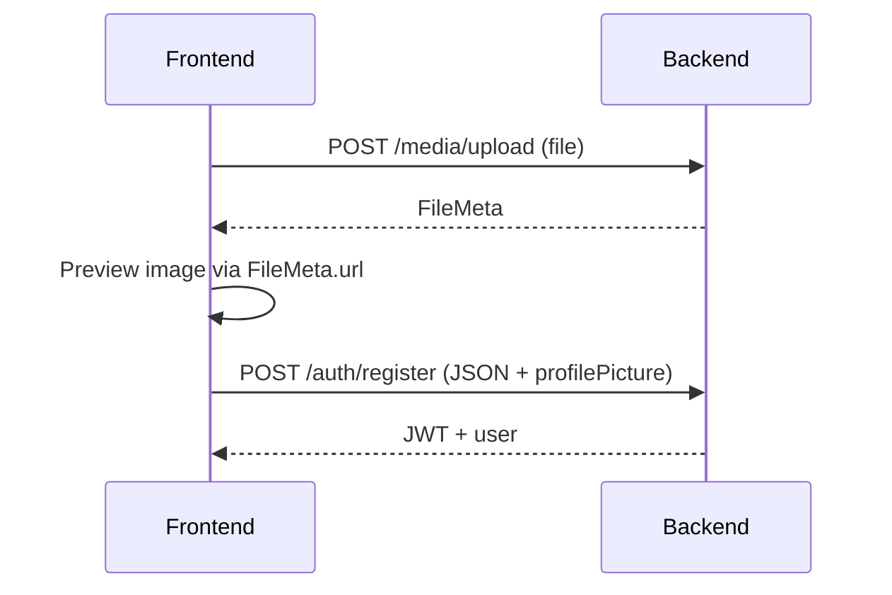

# My Verse — Registration & Profile Pictures

> Field specifications and upload flow for public and staff registration.  
> See also: [AUTH.md](./AUTH.md) · [SETUP.md](./SETUP.md) · [Postman](../postman/README.md)

---

## Overview

Registration and profile updates use a **two-step flow**:

1. **Upload** — `POST /api/v1/media/upload` with the image file → returns a **FileMeta** object
2. **Register / Update** — JSON body includes `profilePicture: FileMeta` (not a file blob or base64)

The frontend renders the avatar with `profilePicture.url` (e.g. `http://localhost:3000/uploads/profiles/abc.jpg`).

---

## FileMeta object

Returned by upload and accepted by register/update endpoints.

```json
{
  "path": "profiles/a1b2c3d4-e5f6-7890-abcd-ef1234567890.jpg",
  "url": "/uploads/profiles/a1b2c3d4-e5f6-7890-abcd-ef1234567890.jpg",
  "filename": "a1b2c3d4-e5f6-7890-abcd-ef1234567890.jpg",
  "mimeType": "image/jpeg",
  "size": 245760,
  "uploadedAt": "2026-06-29T12:00:00.000Z"
}
```

| Field | Description |
|-------|-------------|
| `path` | Internal storage path (under `.uploads/`) |
| `url` | Public URL path — prepend server origin for full URL |
| `filename` | Stored filename |
| `mimeType` | `image/jpeg`, `image/png`, or `image/webp` |
| `size` | File size in bytes (max 5,242,880 / 5 MB) |
| `uploadedAt` | ISO 8601 timestamp |

The server validates that the file exists on disk and that `path`, `url`, `filename`, and `size` are consistent before accepting `profilePicture` on register/update.

---

## Upload API

```
POST /api/v1/media/upload
Content-Type: multipart/form-data
Auth: none (public)
```

| Form field | Type | Required |
|------------|------|----------|
| `file` | file | Yes |

**Limits:** jpeg, png, webp only · max 5 MB

**Response:**

```json
{
  "success": true,
  "data": {
    "path": "profiles/...",
    "url": "/uploads/profiles/...",
    "filename": "...",
    "mimeType": "image/jpeg",
    "size": 245760,
    "uploadedAt": "2026-06-29T12:00:00.000Z"
  }
}
```

---

## Public user registration

```
POST /api/v1/auth/register
Content-Type: application/json
Auth: none
```

| Field | Type | Required | Rules |
|-------|------|----------|-------|
| `email` | string | Yes | Valid email, unique |
| `username` | string | Yes | Min 3 chars; letters, numbers, underscore only |
| `password` | string | Yes | Min 8 chars |
| `displayName` | string | No | Display name |
| `profilePicture` | FileMeta | No | From upload API |

**Example:**

```json
{
  "email": "user@example.com",
  "username": "johndoe",
  "password": "securePass123",
  "displayName": "John Doe",
  "profilePicture": {
    "path": "profiles/a1b2c3d4.jpg",
    "url": "/uploads/profiles/a1b2c3d4.jpg",
    "filename": "a1b2c3d4.jpg",
    "mimeType": "image/jpeg",
    "size": 245760,
    "uploadedAt": "2026-06-29T12:00:00.000Z"
  }
}
```

**Result:** `User` with `role: PUBLIC`. Returns JWT + user.

---

## Staff user registration

```
POST /api/v1/auth/register/staff
Content-Type: application/json
Auth: none
```

### Account fields

| Field | Type | Required | Rules |
|-------|------|----------|-------|
| `email` | string | Yes | Valid email, unique |
| `username` | string | Yes | Min 3 chars; letters, numbers, underscore only |
| `password` | string | Yes | Min 8 chars |
| `displayName` | string | Yes | Display name |
| `profilePicture` | FileMeta | Yes | From upload API |

### Staff profile fields

| Field | Type | Required | Rules |
|-------|------|----------|-------|
| `stageName` | string | Yes | Performer / stage name |
| `bio` | string | Yes | Short biography |
| `gender` | enum | Yes | `MALE`, `FEMALE`, or `PREFER_NOT_TO_DISCLOSE` |
| `heightCm` | integer | Yes | Height in centimeters (min 1) |
| `weightG` | integer | Yes | Weight in grams (min 1) |
| `likes` | string[] | Yes | Interests / preferences (may be empty `[]`) |
| `location` | string | No | Location |
| `skills` | string[] | No | e.g. `["acting", "voice"]` |
| `dateOfBirth` | string | No | ISO 8601 date |
| `socialLinks` | object[] | No | `{ platform, url }` each |

#### Additional fields when `gender` is `FEMALE` (all required)

| Field | Type | Rules |
|-------|------|-------|
| `chestCm` | integer | Chest measurement in cm (min 1) |
| `waistCm` | integer | Waist measurement in cm (min 1) |
| `hipsCm` | integer | Hips measurement in cm (min 1) |
| `cupSize` | string | Exactly 4 characters |

#### Additional fields when `gender` is `MALE` (all required)

| Field | Type | Rules |
|-------|------|-------|
| `lengthLimpMm` | integer | Length when limp, in millimeters (min 1) |
| `lengthErectMm` | integer | Length when erect, in millimeters (min 1) |
| `girthMm` | integer | Girth in millimeters (min 1) |
| `loadCapacityMl` | integer | Load capacity in milliliters (min 1) |

When `gender` is `PREFER_NOT_TO_DISCLOSE`, only the common fields above are required. Gender-specific measurements are not stored.

**Example (female):**

```json
{
  "email": "performer@example.com",
  "username": "star_performer",
  "password": "securePass123",
  "displayName": "Star Performer",
  "profilePicture": { "...FileMeta..." },
  "stageName": "Star",
  "bio": "Professional performer with 10 years experience.",
  "gender": "FEMALE",
  "heightCm": 170,
  "weightG": 62000,
  "likes": ["acting", "voice", "dance"],
  "chestCm": 88,
  "waistCm": 65,
  "hipsCm": 92,
  "cupSize": "32DD",
  "location": "Los Angeles",
  "skills": ["acting", "voice"],
  "dateOfBirth": "1990-05-15",
  "socialLinks": [
    { "platform": "instagram", "url": "https://instagram.com/star" }
  ]
}
```

**Example (male):** same common fields, plus `lengthLimpMm`, `lengthErectMm`, `girthMm`, `loadCapacityMl` instead of the female measurements.

**Result:** `User` with `role: STAFF` + `StaffProfile`. Returns JWT + user (includes `staffProfile`).

**Profile complete:** `staffProfile.isProfileComplete` is `true` when `profilePicture`, `stageName`, `bio`, and all required body fields for the selected `gender` are set.

---

## Update staff profile (logged-in staff)

```
PATCH /api/v1/staff/me
Authorization: Bearer <token>
```

All fields are optional on update, but the **merged profile** must still satisfy gender-based required fields. If you change `gender`, include the measurements required for the new value.

| Field | Type |
|-------|------|
| `stageName` | string |
| `bio` | string |
| `gender` | `MALE` \| `FEMALE` \| `PREFER_NOT_TO_DISCLOSE` |
| `heightCm` | integer |
| `weightG` | integer |
| `likes` | string[] |
| `chestCm`, `waistCm`, `hipsCm`, `cupSize` | female measurements |
| `lengthLimpMm`, `lengthErectMm`, `girthMm`, `loadCapacityMl` | male measurements |
| `location` | string |
| `skills` | string[] |
| `dateOfBirth` | ISO date string |
| `socialLinks` | `{ platform, url }[]` |

---

## Update profile picture (logged-in user)

```
PATCH /api/v1/users/me
Authorization: Bearer <token>
```

Include `profilePicture` FileMeta from a new upload. Allowed fields:

| Field | Type |
|-------|------|
| `displayName` | string |
| `nsfwEnabled` | boolean |
| `defaultVisibility` | enum |
| `profilePicture` | FileMeta |

Staff users: updating `profilePicture` also refreshes `staffProfile.isProfileComplete`.

---

## Admin create user

Same `profilePicture` FileMeta rules:

- **PUBLIC** — `profilePicture` optional
- **STAFF** — `profilePicture` required + `staffProfile` object required (including `gender`, `heightCm`, `weightG`, `likes`, and gender-specific fields when applicable)

---

## Frontend flow (recommended)



1. User selects image → upload immediately (or on form submit before register)
2. Store `FileMeta` in form state
3. Show preview: `${API_ORIGIN}${fileMeta.url}`
4. Submit registration JSON with `profilePicture: fileMeta`
5. On profile edit, re-upload if image changed, then `PATCH /users/me`

---

## Document History

| Date | Change |
|------|--------|
| 2026-06-29 | Staff profile body fields (gender, measurements, likes) |
